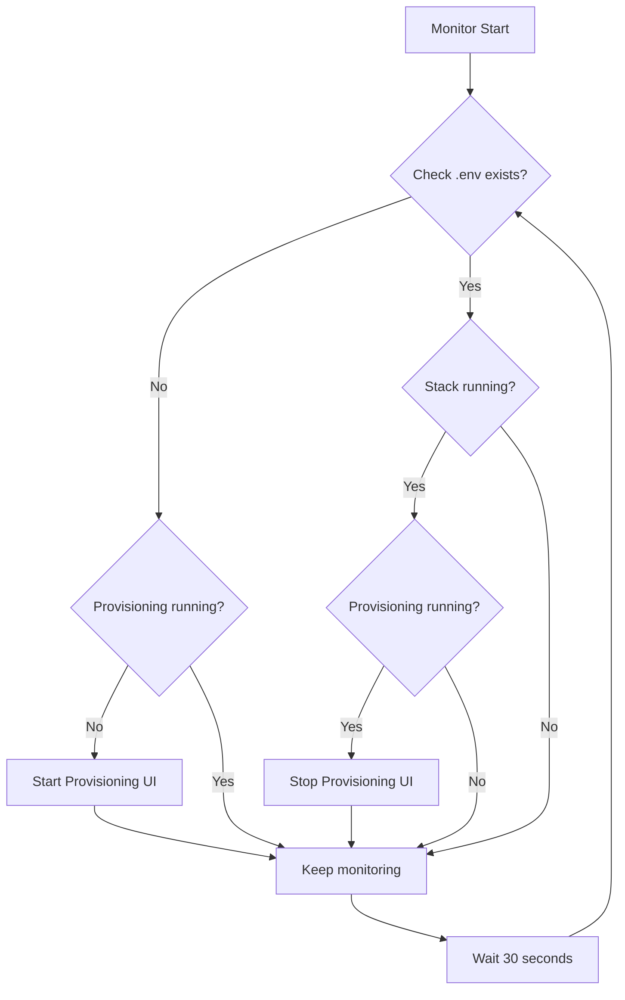

# Auto-Provisioning Guide

## Overview

The AI Stack Master can automatically detect when no configuration exists and launch the provisioning interface. This ensures new deployments always have a smooth setup experience without manual intervention.

## Quick Start

### Option 1: Systemd Service (Recommended for Production)
```bash
# Enable auto-provisioning as a system service
sudo ./deploy/scripts/enable-auto-provisioning.sh

# The service will now:
# - Start on boot
# - Monitor for missing .env
# - Launch provisioning UI when needed
# - Stop provisioning when stack is running
```

### Option 2: Docker Compose (Development/Testing)
```bash
# Start the auto-provisioning monitor
docker compose -f docker-compose.auto-provision.yml up -d

# Check logs
docker logs -f ai-stack-auto-provisioning
```

### Option 3: Manual Monitoring
```bash
# Run the monitor directly
./deploy/scripts/provisioning-monitor.sh monitor
```

## How It Works

### Detection Logic



### Components

1. **Provisioning Monitor** (`provisioning-monitor.sh`)
   - Checks for .env file every 30 seconds
   - Manages provisioning container lifecycle
   - Handles graceful shutdown

2. **Systemd Service** (`ai-stack-provisioning.service`)
   - Runs monitor as system service
   - Auto-starts on boot
   - Manages logs and resources

3. **Docker Monitor** (`docker-compose.auto-provision.yml`)
   - Runs monitor in container
   - Platform-independent
   - Easy to deploy

## Configuration

### Environment Variables

```bash
# Check interval (seconds)
CHECK_INTERVAL=30

# Provisioning URL
PROVISIONING_URL=http://localhost:8080

# Project paths (auto-detected)
PROJECT_ROOT=/home/user/agent-hosting
ENV_FILE=$PROJECT_ROOT/deploy/docker/.env
```

### Systemd Service Options

Edit `/etc/systemd/system/ai-stack-provisioning.service`:

```ini
# Resource limits
MemoryLimit=500M      # Max memory usage
CPUQuota=20%         # Max CPU usage

# Restart policy
Restart=always       # Always restart on failure
RestartSec=10        # Wait 10s before restart
```

## Usage Scenarios

### Fresh Server Deployment

1. Clone repository
2. Run `sudo ./deploy/scripts/enable-auto-provisioning.sh`
3. Reboot server
4. Provisioning UI automatically starts at http://localhost:8080

### Development Environment

1. Delete .env to trigger provisioning
2. Monitor detects missing config
3. Provisioning UI launches
4. Complete setup through web interface
5. UI stops when stack starts

### CI/CD Integration

```yaml
# GitHub Actions example
- name: Deploy Stack
  run: |
    # Start auto-provisioning
    docker compose -f docker-compose.auto-provision.yml up -d
    
    # Wait for provisioning to complete
    timeout 300 bash -c 'until [ -f deploy/docker/.env ]; do sleep 5; done'
    
    # Start main stack
    ./deploy/scripts/install.sh
```

## Management Commands

### Systemd Service

```bash
# Start service
sudo systemctl start ai-stack-provisioning

# Stop service
sudo systemctl stop ai-stack-provisioning

# Check status
sudo systemctl status ai-stack-provisioning

# View logs
sudo journalctl -u ai-stack-provisioning -f

# Disable auto-start
sudo systemctl disable ai-stack-provisioning

# Re-enable auto-start
sudo systemctl enable ai-stack-provisioning
```

### Docker Compose

```bash
# Start monitor
docker compose -f docker-compose.auto-provision.yml up -d

# Stop monitor
docker compose -f docker-compose.auto-provision.yml down

# View logs
docker compose -f docker-compose.auto-provision.yml logs -f

# Restart monitor
docker compose -f docker-compose.auto-provision.yml restart
```

### Direct Script

```bash
# Check status
./deploy/scripts/provisioning-monitor.sh status

# Start provisioning manually
./deploy/scripts/provisioning-monitor.sh start

# Stop provisioning manually
./deploy/scripts/provisioning-monitor.sh stop
```

## Troubleshooting

### Monitor Not Starting

```bash
# Check service status
sudo systemctl status ai-stack-provisioning

# Check for errors
sudo journalctl -u ai-stack-provisioning --since "10 minutes ago"

# Verify script permissions
ls -la deploy/scripts/provisioning-monitor.sh
```

### Provisioning Not Launching

```bash
# Check Docker is running
docker ps

# Check compose file exists
ls -la docker-compose.provisioning.yml

# Test manual start
./provision.sh
```

### False Positives

If provisioning starts when it shouldn't:

```bash
# Check .env location
ls -la deploy/docker/.env

# Check stack status
docker ps --filter "name=app-"

# Adjust detection logic in monitor script
```

## Security Considerations

### Systemd Service
- Runs as non-root user
- Limited resource usage
- Private tmp directory
- No new privileges

### Network Access
- Provisioning UI on localhost only
- No authentication (temporary service)
- Auto-stops when configured

### File Permissions
- .env created with 600 permissions
- Backups stored securely
- Monitor has read-only access (except .env creation)

## Advanced Configuration

### Custom Check Interval

```bash
# Edit monitor script
CHECK_INTERVAL=60  # Check every minute

# Or set in docker-compose
environment:
  - CHECK_INTERVAL=60
```

### Multiple Environments

```bash
# Monitor specific project
PROJECT_ROOT=/path/to/project ./deploy/scripts/provisioning-monitor.sh monitor

# Or create multiple services
cp ai-stack-provisioning.service ai-stack-dev.service
# Edit paths in new service file
```

### Notification Integration

Add to monitor script:
```bash
# Slack notification
curl -X POST -H 'Content-type: application/json' \
  --data '{"text":"Provisioning started for AI Stack Master"}' \
  YOUR_SLACK_WEBHOOK_URL

# Email notification (requires mail setup)
echo "Provisioning started" | mail -s "AI Stack Alert" admin@example.com
```

## Best Practices

1. **Production Servers**: Use systemd service for reliability
2. **Development**: Use docker compose for portability
3. **Security**: Ensure firewall blocks external access to port 8080
4. **Monitoring**: Set up alerts for service failures
5. **Updates**: Disable auto-provisioning before updates

## Summary

Auto-provisioning ensures:
- ✅ Zero-touch deployment for new installations
- ✅ Automatic recovery from configuration loss
- ✅ Clean separation of provisioning and runtime
- ✅ Resource-efficient monitoring
- ✅ Platform-independent operation

The system handles the entire lifecycle from detecting missing configuration to launching the provisioning UI and cleaning up after successful deployment.