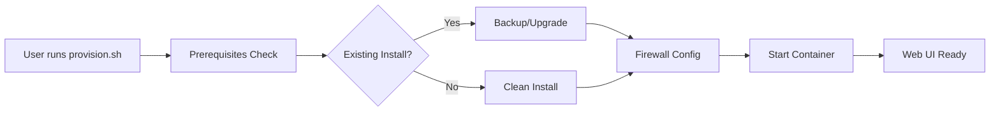
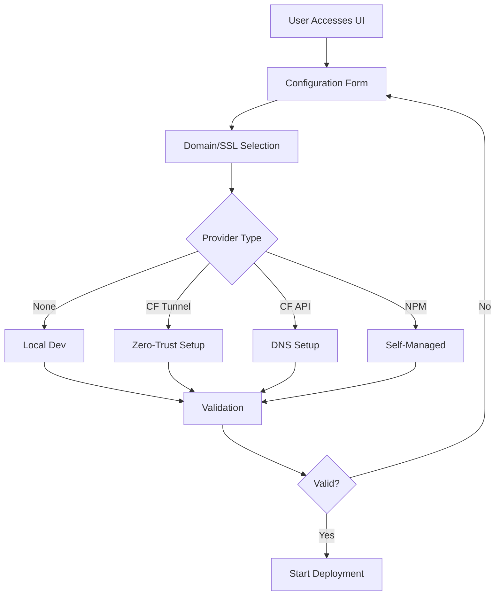

# AI Stack Master - Provisioning Architecture

## Overview

The provisioning system is a sophisticated web-based deployment platform that serves as the **primary entry point** for deploying the AI Stack Master. It provides a user-friendly interface for configuring, validating, and deploying the entire monitoring and observability stack.

## Architecture Components

### 1. Bootstrap Layer (`provision.sh`)
The initial entry point that prepares the server environment:

```bash
┌─────────────────────────────────────────┐
│           provision.sh                  │
│  ┌─────────────────────────────────┐   │
│  │  Prerequisites Check            │   │
│  │  - Docker                       │   │
│  │  - Docker Compose               │   │
│  │  - Git (optional)               │   │
│  └─────────────────────────────────┘   │
│  ┌─────────────────────────────────┐   │
│  │  Existing Installation Check    │   │
│  │  - .env detection               │   │
│  │  - Running containers           │   │
│  │  - Backup/Upgrade options       │   │
│  └─────────────────────────────────┘   │
│  ┌─────────────────────────────────┐   │
│  │  Firewall Configuration         │   │
│  │  - UFW/FirewallD detection      │   │
│  │  - Port rules (8080,3000-3002)  │   │
│  └─────────────────────────────────┘   │
│  ┌─────────────────────────────────┐   │
│  │  Provisioning Container Launch  │   │
│  │  - Docker Compose build/up      │   │
│  │  - Health check verification    │   │
│  └─────────────────────────────────┘   │
└─────────────────────────────────────────┘
```

### 2. Provisioning Container
Docker container running the web interface:

```yaml
Container: ai-stack-provisioning
├── Node.js Express Server (port 8080)
├── WebSocket Server (real-time updates)
├── Docker CLI (stack management)
└── Project Volume Mounts
    ├── /workspace (read-only project)
    ├── /workspace/deploy/docker (read-write for .env)
    └── /var/run/docker.sock (Docker control)
```

### 3. Web Interface Architecture

#### Backend (`server-integrated.js`)
```javascript
Express Server (8080)
├── API Endpoints
│   ├── GET  /api/health
│   ├── GET  /api/check-existing
│   ├── GET  /api/domain-types
│   ├── POST /api/validate
│   ├── POST /api/deploy
│   ├── POST /api/deploy/:id/retry
│   ├── GET  /api/deploy/:id/status
│   └── POST /api/verify-deployment
├── WebSocket Server
│   ├── Connection Management
│   ├── Real-time Progress Updates
│   └── Log Streaming
└── Integration Points
    ├── generate-env-config.sh
    ├── install.sh
    ├── validators.js
    └── post-deploy-check.js
```

#### Frontend (Static HTML/JS)
```
Provisioning UI
├── Configuration Form
│   ├── Domain Settings
│   ├── SSL/DNS Provider Selection
│   ├── Admin Credentials
│   └── Advanced Options
├── Progress Dashboard
│   ├── 13-Step Progress Tracker
│   ├── Real-time Log Viewer
│   ├── Error Handling
│   └── Retry Mechanisms
└── Verification Results
    ├── Service Health Matrix
    ├── Access URLs
    └── Next Steps Guide
```

## Deployment Workflow

### Phase 1: Environment Preparation


### Phase 2: Configuration & Validation


### Phase 3: Deployment Execution
The deployment follows these 13 steps aligned with `install.sh`:

1. **Validate Environment** - System requirements check
2. **Environment Configuration** - Generate .env via `generate-env-config.sh`
3. **Cleanup** - Stop services and clean resources
4. **Pull Core Images** - PostgreSQL, Redis, MITM Proxy
5. **Pull Monitoring Stack** - Prometheus, Grafana, Loki
6. **Pull Applications** - n8n, GoTrue, Stack Manager
7. **Build Custom Images** - Project-specific containers
8. **Verify Images** - Ensure all images exist
9. **Start Stack** - Docker Compose up
10. **Wait for Health** - Container health checks
11. **Configure Services** - Post-start configuration
12. **Verify Services** - Endpoint accessibility
13. **Verify URLs** - Final validation of all access points

## Security Architecture

### Network Security
```
┌─────────────────────────────────────────┐
│         Provisioning Phase              │
│  ┌─────────────────────────────────┐   │
│  │  Temporary UI (port 8080)       │   │
│  │  - No authentication            │   │
│  │  - Limited to setup only        │   │
│  │  - Auto-shutdown after deploy   │   │
│  └─────────────────────────────────┘   │
└─────────────────────────────────────────┘
                    ↓
┌─────────────────────────────────────────┐
│         Production Phase                │
│  ┌─────────────────────────────────┐   │
│  │  Secured Services               │   │
│  │  - JWT Authentication (GoTrue)  │   │
│  │  - SSL/TLS (configured)         │   │
│  │  - Firewall rules applied       │   │
│  └─────────────────────────────────┘   │
└─────────────────────────────────────────┘
```

### Configuration Security
- Passwords auto-generated with strong entropy
- API tokens validated but never logged
- Existing configurations backed up before modification
- Environment variables properly escaped

## File System Structure

```
/workspace (container view)
├── provision.sh                    # Bootstrap script
├── install.sh                      # Main installer
├── docker-compose.provisioning.yml # Provisioning stack
├── apps/
│   └── provisioning-web/
│       ├── backend/
│       │   ├── server-integrated.js    # Main server
│       │   ├── validators.js           # Config validation
│       │   ├── post-deploy-check.js   # Health checks
│       │   └── package.json
│       ├── frontend/
│       │   └── index.html             # UI (embedded)
│       └── Dockerfile
└── deploy/
    ├── scripts/
    │   └── generate-env-config.sh     # .env generator
    └── docker/
        ├── .env.example               # Template
        └── .env                       # Generated config
```

## Data Flow

### Configuration Generation
```
User Input → Validation → generate-env-config.sh → .env file
     ↓            ↓                                    ↓
WebSocket ← Progress Updates ← Execution Status ← install.sh
```

### Real-time Updates
```
install.sh output → Server Process → WebSocket → Browser UI
                         ↓
                  Deployment State
                    (persisted)
```

## Integration Points

### 1. Environment Script Integration
The provisioning server executes `generate-env-config.sh` with user inputs:
```bash
bash generate-env-config.sh \
  --domain "$DOMAIN" \
  --email "$EMAIL" \
  --ssl-provider "$SSL_PROVIDER" \
  --non-interactive
```

### 2. Install Script Integration
After .env creation, executes `install.sh`:
```bash
cd /workspace
./install.sh --clean  # Or appropriate flags
```

### 3. Health Check Integration
Post-deployment verification via `post-deploy-check.js`:
- Service endpoint checks
- Authentication validation
- SSL certificate verification
- Database connectivity

## Error Handling & Recovery

### Retry Mechanisms
- Each deployment step can be retried independently
- Failed deployments preserve state for debugging
- Automatic rollback on critical failures

### Logging & Diagnostics
```
/app/data/
├── .provision-state.json    # Deployment state
├── deployments/
│   └── {id}/
│       ├── config.json     # Deployment config
│       ├── install.log     # Full output
│       └── status.json     # Step status
```

## SSL/DNS Provider Details

### Cloudflare Tunnel (Recommended)
- Zero-trust architecture
- No port forwarding required
- Automatic SSL certificates
- Built-in DDoS protection

### Cloudflare API
- Traditional DNS management
- Requires API token with Zone:Edit permissions
- Automatic DNS record creation
- SSL via Cloudflare proxy

### Nginx Proxy Manager
- Self-managed SSL certificates
- Let's Encrypt integration
- Local reverse proxy
- Requires port 80/443 forwarding

## Performance Considerations

### Resource Usage
- Provisioning container: ~100MB RAM
- Deployment process: Variable (1-5GB for image pulls)
- Disk space: ~10GB for full stack

### Optimization Strategies
- Parallel image pulls where possible
- Cached deployment states
- Incremental updates for existing installations
- Cleanup of provisioning container after deployment

## Troubleshooting Guide

### Common Issues

1. **Container won't start**
   ```bash
   docker compose -f docker-compose.provisioning.yml logs
   docker ps -a | grep provisioning
   ```

2. **Web UI not accessible**
   - Check firewall rules
   - Verify port 8080 is free
   - Test with curl: `curl http://localhost:8080/api/health`

3. **Deployment failures**
   - Check deployment logs in UI
   - Verify Docker daemon access
   - Ensure sufficient disk space
   - Check network connectivity for image pulls

4. **SSL/DNS issues**
   - Validate API credentials
   - Check domain DNS propagation
   - Verify firewall allows ports 80/443
   - Review provider-specific logs

## Development Notes

### Local Development
```bash
cd apps/provisioning-web/backend
npm install
PROJECT_ROOT=../../.. npm start
```

### Testing Endpoints
```bash
# Health check
curl http://localhost:8080/api/health

# Validation
curl -X POST http://localhost:8080/api/validate \
  -H "Content-Type: application/json" \
  -d '{"domain": "test.example.com", "adminEmail": "admin@example.com"}'

# Check existing
curl http://localhost:8080/api/check-existing
```

### Building Updates
```bash
docker compose -f docker-compose.provisioning.yml build --no-cache
docker compose -f docker-compose.provisioning.yml up -d
```

## Future Enhancements

### Planned Features
1. **Multi-node deployment** - Cluster provisioning support
2. **Backup/Restore UI** - Integrated data management
3. **Plugin System** - Custom provisioning steps
4. **Mobile UI** - Responsive design for tablets
5. **API Mode** - Headless provisioning for automation

### Architecture Evolution
- Kubernetes operator for cloud deployments
- Terraform provider for infrastructure as code
- Ansible playbooks for complex environments
- CI/CD pipeline integration

## Summary

The provisioning system provides a production-ready, user-friendly deployment experience that abstracts the complexity of the AI Stack Master while maintaining flexibility and security. Its architecture ensures reliable, repeatable deployments with comprehensive validation and error handling.