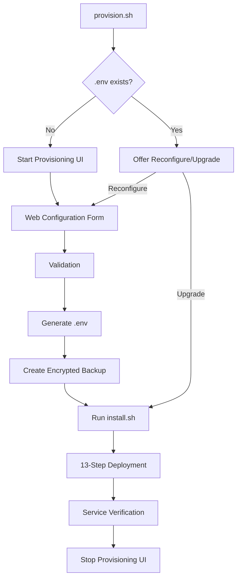

# AI Stack Master Provisioning System - Complete Documentation

## Table of Contents

1. [Overview](#overview)
2. [Quick Start](#quick-start)
3. [Architecture](#architecture)
4. [Features](#features)
5. [Installation Methods](#installation-methods)
6. [Configuration](#configuration)
7. [Security](#security)
8. [API Reference](#api-reference)
9. [Troubleshooting](#troubleshooting)
10. [Development](#development)
11. [Advanced Topics](#advanced-topics)

---

## Overview

The AI Stack Master Provisioning System is a sophisticated web-based deployment platform that serves as the **primary entry point** for deploying the entire AI monitoring and observability stack. It provides automatic detection of missing configurations, a user-friendly setup wizard, and enterprise-grade security features including encrypted backups.

### Key Capabilities

- 🚀 **Zero-Touch Deployment** - Automatically launches when no configuration exists
- 🔒 **Encrypted Backups** - SOPS + Age encryption for configuration security
- 🌐 **Multi-Provider SSL/DNS** - Support for Cloudflare, NPM, and local development
- 📊 **Real-Time Progress** - WebSocket-based deployment tracking
- 🔄 **Auto-Recovery** - Retry mechanisms and rollback capabilities
- 🎯 **Production-Ready** - Enterprise security and validation

---

## Quick Start

### One-Line Installation

```bash
# Download and run provisioning
curl -fsSL https://raw.githubusercontent.com/Tech-to-Thrive/agent-hosting/main/provision.sh | bash
```

### Git Installation

```bash
# Clone repository
git clone https://github.com/Tech-to-Thrive/agent-hosting.git
cd agent-hosting

# Run provisioning
./provision.sh

# Access web UI
# http://localhost:8080
```

### Enable Auto-Provisioning

The system can automatically detect when provisioning is needed and start the web interface:

```bash
# Method 1: Docker-based auto-provisioning (recommended)
docker compose -f docker-compose.auto-provision.yml up -d

# Method 2: System service (Linux)
sudo cp deploy/systemd/ai-stack-provisioning.service /etc/systemd/system/
sudo systemctl enable --now ai-stack-provisioning.service

# Method 3: Shell profile (user-level)
echo 'source ~/agent-hosting/deploy/scripts/auto-provision.sh' >> ~/.bashrc
```

See [AUTO_PROVISIONING.md](../../../docs/AUTO_PROVISIONING.md) for detailed auto-start options.

---

## Architecture

### System Components

```
┌─────────────────────────────────────────┐
│           provision.sh                  │  ← Bootstrap Script
│  ┌─────────────────────────────────┐   │
│  │  Prerequisites Check            │   │
│  │  Existing Installation Check    │   │
│  │  Firewall Configuration         │   │
│  │  Provisioning Container Launch  │   │
│  └─────────────────────────────────┘   │
└─────────────────────────────────────────┘
                    ↓
┌─────────────────────────────────────────┐
│      Provisioning Container             │  ← Docker Container
│  ┌─────────────────────────────────┐   │
│  │  Node.js Express Server (8080)  │   │
│  │  WebSocket Real-time Updates    │   │
│  │  Docker CLI Integration         │   │
│  │  Encryption Manager             │   │
│  └─────────────────────────────────┘   │
└─────────────────────────────────────────┘
                    ↓
┌─────────────────────────────────────────┐
│         Main Stack Deployment           │  ← 19 Services
│  ┌─────────────────────────────────┐   │
│  │  PostgreSQL, Redis, n8n         │   │
│  │  Grafana, Prometheus, Loki      │   │
│  │  Stack Manager, GoTrue Auth     │   │
│  │  Custom Exporters & Proxies     │   │
│  └─────────────────────────────────┘   │
└─────────────────────────────────────────┘
```

### Deployment Workflow



### File Structure

```
agent-hosting/
├── provision.sh                          # Bootstrap entry point
├── docker-compose.provisioning.yml       # Provisioning stack
├── apps/
│   └── provisioning-web/
│       ├── backend/
│       │   ├── server-integrated.js      # Main server with WebSocket
│       │   ├── validators.js             # Configuration validation
│       │   ├── post-deploy-check.js      # Service verification
│       │   ├── encryption-integration.js # SOPS/Age encryption
│       │   └── tools/                    # Encryption utilities
│       ├── frontend/
│       │   └── (embedded in server)      # React UI
│       ├── Dockerfile                    # Container definition
│       └── docs/                         # Documentation
├── deploy/
│   ├── scripts/
│   │   ├── generate-env-config.sh        # Environment generator
│   │   ├── install.sh                    # Main installer
│   │   ├── provisioning-monitor.sh       # Auto-detection script
│   │   └── enable-auto-provisioning.sh   # Systemd setup
│   └── docker/
│       ├── .env.example                  # Configuration template
│       ├── .env                          # Generated configuration
│       └── env-backups/                  # Encrypted backups
└── memory-bank/                          # Project knowledge base
```

---

## Features

### 1. Automatic Provisioning Detection

The system automatically detects when no configuration exists and launches the provisioning interface:

```bash
# Monitor runs every 30 seconds checking for:
- Missing .env file → Start provisioning UI
- Existing .env + Stack running → Stop provisioning UI
- Existing .env + Stack not running → Keep UI available
```

### 2. Multi-Stage Deployment UI

13-step deployment process with real-time progress:

1. **Validate Environment** - System requirements check
2. **Environment Configuration** - Generate .env file
3. **Cleanup** - Stop services and clean resources
4. **Pull Core Images** - PostgreSQL, Redis, MITM Proxy
5. **Pull Monitoring Stack** - Prometheus, Grafana, Loki
6. **Pull Applications** - n8n, GoTrue, Stack Manager
7. **Build Custom Images** - Project-specific containers
8. **Verify Images** - Ensure all images exist
9. **Start Stack** - Docker Compose up
10. **Wait for Health** - Container health checks
11. **Configure Services** - Post-start configuration
12. **Verify Services** - Endpoint accessibility
13. **Verify URLs** - Final validation

### 3. Encrypted Configuration Backups

Every deployment automatically creates encrypted backups:

```bash
# Encryption features:
- SOPS + Age encryption
- Automatic key generation
- Versioned backups with metadata
- One-click restoration
- Fallback to secure unencrypted backups
```

### 4. SSL/DNS Provider Integration

Support for multiple SSL/DNS providers:

#### None (Local Development)
- No SSL configuration
- Local access only
- Perfect for development

#### Cloudflare Tunnel (Recommended)
- Zero-trust architecture
- No port forwarding required
- Automatic SSL certificates
- Built-in DDoS protection

#### Cloudflare API
- Traditional DNS management
- Automatic DNS record creation
- SSL via Cloudflare proxy

#### Nginx Proxy Manager
- Self-managed SSL certificates
- Let's Encrypt integration
- Local reverse proxy

### 5. Comprehensive Validation

Pre-deployment validation includes:

- Domain format validation
- Port conflict detection
- SSL provider requirement checks
- Email validation
- Password strength requirements
- Docker resource availability

### 6. Real-Time Updates

WebSocket-based communication provides:

- Live deployment logs
- Step-by-step progress tracking
- Error messages with context
- Retry capabilities per step
- Overall deployment status

---

## Installation Methods

### Method 1: Manual Provisioning

```bash
# Run when you want to configure
./provision.sh

# Access UI
http://localhost:8080
```

### Method 2: Systemd Auto-Provisioning (Production)

```bash
# Enable automatic provisioning
sudo ./deploy/scripts/enable-auto-provisioning.sh

# Service will:
- Start on boot
- Monitor for missing .env
- Launch UI when needed
- Stop UI when configured
```

### Method 3: Docker Auto-Provisioning (Development)

```bash
# Start monitoring container
docker compose -f docker-compose.auto-provision.yml up -d

# Check logs
docker logs -f ai-stack-auto-provisioning
```

### Method 4: CI/CD Integration

```yaml
# GitHub Actions example
- name: Deploy Stack
  run: |
    # Start provisioning if needed
    if [ ! -f deploy/docker/.env ]; then
      ./provision.sh --auto &
      # Wait for .env creation
      timeout 300 bash -c 'until [ -f deploy/docker/.env ]; do sleep 5; done'
    fi
    # Deploy stack
    ./deploy/scripts/install.sh
```

---

## Configuration

### Environment Variables

The provisioning system generates a comprehensive .env file with:

```bash
# Domain Configuration
DOMAIN=example.com
ADMIN_EMAIL=admin@example.com

# SSL/DNS Provider
SSL_PROVIDER=cloudflare-tunnel  # or cloudflare-api, npm, none
CF_TUNNEL_TOKEN=...             # For Cloudflare Tunnel
CF_API_TOKEN=...                # For Cloudflare API
CF_ZONE_ID=...                  # For Cloudflare API

# Authentication
MASTER_ADMIN_PASS=...           # Master password for all services
JWT_SECRET=...                  # JWT signing secret
ANON_KEY=...                    # Supabase anonymous key
SERVICE_KEY=...                 # Supabase service key

# Database
DB_PASSWORD=...                 # PostgreSQL password
REDIS_PASSWORD=...              # Redis password

# Encryption Keys
ENCRYPTION_KEY=...              # General encryption
N8N_ENCRYPTION_KEY=...          # n8n specific encryption
```

### Backup Configuration

Backups are stored in `deploy/docker/env-backups/`:

```json
{
  "versions": [
    {
      "name": "env-2025-01-10T14-30-00",
      "timestamp": "2025-01-10T14:30:00.000Z",
      "description": "Provisioning deployment - example.com",
      "encrypted": true,
      "createdBy": "provisioning-app"
    }
  ],
  "current": "env-2025-01-10T14-30-00"
}
```

---

## Security

### Encryption

- **Algorithm**: Age (modern encryption by FiloSottile)
- **Integration**: SOPS (Mozilla's secrets management)
- **Key Storage**: Local filesystem in `.sops/`
- **Backup Permissions**: 600 (owner read/write only)

### Network Security

```yaml
# Provisioning Phase
- Temporary UI on localhost:8080
- No authentication (limited lifetime)
- Auto-shutdown after deployment

# Production Phase  
- JWT authentication via GoTrue
- SSL/TLS encryption
- Firewall rules enforced
- Service-to-service auth tokens
```

### Best Practices

1. **Never expose port 8080** to the internet
2. **Delete provisioning container** after setup
3. **Backup encryption keys** from `.sops/`
4. **Rotate passwords** quarterly
5. **Monitor access logs** for anomalies

---

## API Reference

### Health Check
```http
GET /api/health

Response: 200 OK
{ "status": "healthy", "version": "1.0.0" }
```

### Check Existing Configuration
```http
GET /api/check-existing

Response: 200 OK
{
  "exists": true,
  "domain": "example.com",
  "sslProvider": "cloudflare-tunnel",
  "createdAt": "2025-01-10T14:30:00.000Z"
}
```

### Validate Configuration
```http
POST /api/validate
Content-Type: application/json

{
  "domain": "example.com",
  "adminEmail": "admin@example.com",
  "sslProvider": "cloudflare-tunnel"
}

Response: 200 OK
{
  "valid": true,
  "errors": [],
  "warnings": ["Port 3000 is in use"],
  "info": ["Cloudflare Tunnel detected"]
}
```

### Start Deployment
```http
POST /api/deploy
Content-Type: application/json

{
  "domain": "example.com",
  "adminEmail": "admin@example.com",
  "sslProvider": "none"
}

Response: 200 OK
{
  "deploymentId": "abc123...",
  "websocketUrl": "ws://localhost:8080",
  "message": "Deployment started"
}
```

### Encryption Status
```http
GET /api/encryption/status

Response: 200 OK
{
  "available": true,
  "configured": true,
  "dependencies": {
    "sops": true,
    "age": true,
    "ageKeysExist": true
  },
  "publicKey": "age1..."
}
```

### List Backups
```http
GET /api/backups

Response: 200 OK
{
  "backups": [
    {
      "name": "env-2025-01-10T14-30-00",
      "timestamp": "2025-01-10T14:30:00.000Z",
      "description": "Provisioning deployment - example.com",
      "encrypted": true
    }
  ]
}
```

### Restore Backup
```http
POST /api/backups/restore
Content-Type: application/json

{
  "backupName": "env-2025-01-10T14-30-00"
}

Response: 200 OK
{
  "success": true,
  "message": "Restored encrypted backup successfully",
  "backupName": "env-2025-01-10T14-30-00"
}
```

### WebSocket Events

Connect to `ws://localhost:8080` after deployment starts:

```javascript
// Connection
ws.send(JSON.stringify({ 
  type: 'subscribe', 
  deploymentId: 'abc123...' 
}));

// Receive updates
{
  "type": "log",
  "deploymentId": "abc123...",
  "stepIndex": 0,
  "log": {
    "timestamp": "2025-01-10T14:30:00.000Z",
    "message": "Checking Docker installation...",
    "level": "info"
  }
}

// State updates
{
  "type": "state",
  "deploymentId": "abc123...",
  "state": {
    "status": "running",
    "currentStep": 2,
    "steps": [...]
  }
}
```

---

## Troubleshooting

### Common Issues

#### Provisioning UI Not Loading

```bash
# Check container
docker ps | grep provisioning

# View logs
docker logs ai-stack-provisioning

# Test endpoint
curl http://localhost:8080/api/health

# Check firewall
sudo ufw status | grep 8080
```

#### Deployment Stuck

```bash
# Check current step
curl http://localhost:8080/api/deploy/{deployment-id}/status

# View install logs
docker exec ai-stack-provisioning tail -f /app/data/deployments/*/install.log

# Check Docker resources
docker system df
docker stats --no-stream
```

#### Encryption Not Working

```bash
# Check tools installed
which sops
which age

# Install if missing
curl -X POST http://localhost:8080/api/encryption/install

# Verify keys exist
ls -la .sops/
```

#### Services Not Starting

```bash
# Check generated .env
cat deploy/docker/.env | grep -E "^[A-Z_]+=" | wc -l
# Should show 20+ variables

# Verify images
docker images | grep -E "(n8n|grafana|postgres)"

# Check compose file
docker compose -f deploy/docker/docker-compose.yml config
```

### Recovery Procedures

#### Restore from Backup

```bash
# List available backups
curl http://localhost:8080/api/backups | jq .

# Restore specific backup
curl -X POST http://localhost:8080/api/backups/restore \
  -H "Content-Type: application/json" \
  -d '{"backupName": "env-2025-01-10T14-30-00"}'
```

#### Manual Encryption Recovery

```bash
# If keys are lost, decrypt with backup key
export SOPS_AGE_KEY_FILE=/backup/location/age-key.txt
sops -d deploy/docker/env-backups/backup.env.encrypted > deploy/docker/.env
```

#### Complete Reset

```bash
# Stop everything
docker compose down -v

# Remove configuration
rm -rf deploy/docker/.env*
rm -rf deploy/docker/env-backups/

# Start fresh
./provision.sh
```

---

## Development

### Local Development

```bash
# Backend development
cd apps/provisioning-web/backend
npm install
npm run dev

# Environment variables for development
export PROJECT_ROOT=../../..
export PORT=8080
```

### Testing

```bash
# Run provisioning tests
cd apps/provisioning-web
npm test

# Integration tests
./test/provisioning/run-integration-tests.sh

# Manual testing checklist
- [ ] Fresh installation
- [ ] Existing installation detection
- [ ] All SSL providers
- [ ] Encryption backup/restore
- [ ] Error recovery
- [ ] WebSocket updates
```

### Building

```bash
# Build provisioning container
docker compose -f docker-compose.provisioning.yml build --no-cache

# Test build
docker compose -f docker-compose.provisioning.yml up
```

### Contributing

1. **Code Style**: Use ESLint configuration
2. **Testing**: Add tests for new features
3. **Documentation**: Update this README
4. **Security**: Follow security best practices
5. **Commits**: Use conventional commits

---

## Advanced Topics

### Multi-Node Deployment

```yaml
# Future: docker-compose.cluster.yml
services:
  provisioning-master:
    extends: provisioning
    environment:
      - ROLE=master
      - NODES=3
```

### Custom SSL Providers

```javascript
// Add to validators.js
const customProvider = {
  name: 'custom-ssl',
  validate: (config) => { /* validation logic */ },
  required: ['API_KEY', 'DOMAIN']
};
```

### Kubernetes Integration

```yaml
# Future: kubernetes/provisioning-job.yaml
apiVersion: batch/v1
kind: Job
metadata:
  name: ai-stack-provisioning
spec:
  template:
    spec:
      containers:
      - name: provisioning
        image: ai-stack/provisioning:latest
```

### Terraform Provider

```hcl
# Future: terraform/main.tf
resource "ai_stack" "main" {
  domain = "example.com"
  ssl_provider = "cloudflare-tunnel"
  admin_email = "admin@example.com"
}
```

---

## Appendix

### A. Complete Feature List

- ✅ Zero-touch deployment
- ✅ Auto-detection of missing config
- ✅ Web-based configuration UI
- ✅ Real-time deployment progress
- ✅ Encrypted configuration backups
- ✅ Multi-provider SSL/DNS support
- ✅ Comprehensive validation
- ✅ Error recovery mechanisms
- ✅ WebSocket live updates
- ✅ Systemd service integration
- ✅ Docker-based monitoring
- ✅ API for automation
- ✅ Production security hardening

### B. Version History

- **v1.0.0** - Initial provisioning system
- **v1.1.0** - Added encryption support
- **v1.2.0** - Auto-provisioning monitor
- **v1.3.0** - WebSocket real-time updates
- **v1.4.0** - Multi-provider SSL/DNS

### C. License

MIT License - See LICENSE file

### D. Support

- GitHub Issues: [Report bugs](https://github.com/Tech-to-Thrive/agent-hosting/issues)
- Documentation: [This file](./README_COMPLETE.md)
- Community: [Discord/Slack]

---

*Last Updated: January 2025*